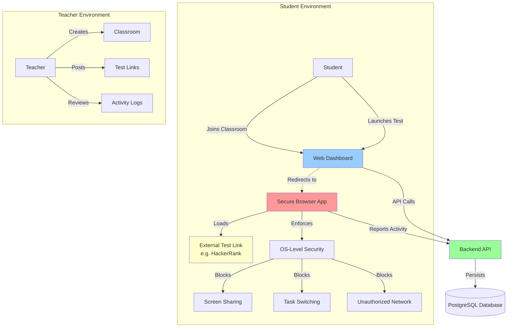
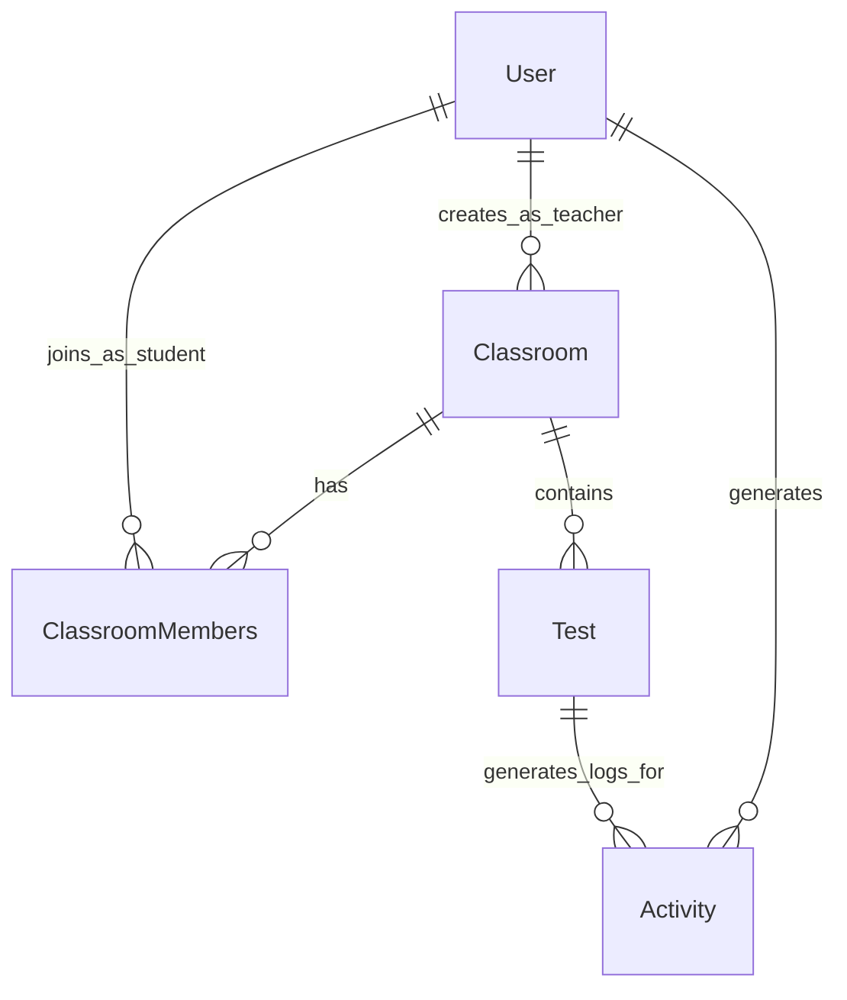
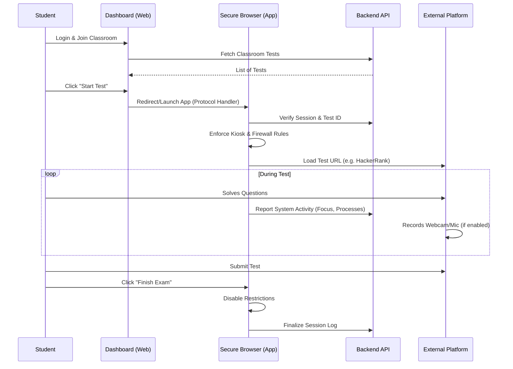

# Architecture

## System Overview

Omniproctor operates on a **Classroom-based model** (similar to Google Classroom) where teachers create virtual classrooms and students join via invite links. The system is designed to complement existing assessment platforms (like HackerRank, Google Forms, etc.) by providing the **OS-level security layer** that web-based platforms cannot enforce.

While the assessment platform handles the test content, AI proctoring, and webcam/microphone monitoring, Omniproctor's secure browser ensures the integrity of the local machine environment by preventing screen sharing, task switching, and unauthorized network access.

## Architecture Diagram

## Core Components

### 1. Secure Browser Application (PyQt6)

The secure browser is a standalone desktop application built with PyQt6 and QWebEngine. It serves as the primary interface for test-takers.

**Key Responsibilities:**

- **Test Execution**: Loads external test links (HackerRank, Forms, etc.) in a controlled environment
- **OS-Level Security**: Fills the gaps of web-based proctoring:
    - **Anti-Screen Sharing**: Prevents external apps (Discord, Teams, UltraViewer, RustDesk, HelpWire, etc) from capturing the screen
    - **Anti-Task Switching**: Blocks Alt+Tab, WinKey, and many more special keys
    - **Network Isolation**: Whitelists only the test domain
- **Activity Monitoring**: Tracks system events (focus loss, unauthorized process attempts) and reports to dashboard

**Technology Stack:**
- PyQt6 for UI framework
- QWebEngine for browser rendering
- Windows API for system-level controls
- SimpleWall integration for network filtering

### 2. Backend API (Node.js/Express)

The backend serves as the central hub for all data operations and business logic.

**Key Responsibilities:**

- **Authentication & Authorization**: JWT-based auth with role management
- **Classroom Management**: Create classrooms, generate invite links, manage members
- **Test Management**: Distribute external test links to classrooms
- **Activity Tracking**: Log and monitor user activities during tests
- **Data Validation**: Middleware for request validation

**Technology Stack:**
- Node.js runtime
- Express.js web framework
- Prisma ORM for database operations
- bcryptjs for password hashing
- jsonwebtoken for authentication

### 3. Frontend Dashboard (React/Vite)

Modern single-page application for test management and administration.

**Key Responsibilities:**

- **User Interface**: Responsive dashboard for admins and users
- **Test Management**: Create and configure assessments
- **User Management**: View and manage users
- **Real-time Updates**: Display active tests and submissions
- **State Management**: Context API for authentication state

### 4. Database Layer (PostgreSQL/Prisma)

Relational database managed through Prisma ORM.

**Schema Components:**

- **Users Table**: Teachers and Students
- **Classrooms Table**: Virtual spaces created by teachers
- **ClassroomMembers Table**: Junction table for student enrollment
- **Tests Table**: External test links assigned to classrooms
- **Activities Table**: OS-level events logged during test sessions

**Relationships:**

## Proctoring Philosophy & Scope

Omniproctor is designed to work **in tandem** with existing assessment platforms, not to replace them.

| Feature | Handled by Test Platform (e.g., HackerRank) | Handled by Omniproctor (Secure Browser) |
|---------|---------------------------------------------|-----------------------------------------|
| **Content** | Questions, Code compilation, Submission | Rendering the platform |
| **Identity** | Login to platform | Login to Dashboard/App |
| **A/V Monitoring** | Webcam, Microphone, AI Gaze tracking | N/A (Relies on platform) |
| **Screen Security** | Browser tab focus detection | **Prevents Screen Sharing** (Discord/Zoom), **Blocks Screenshots** |
| **System Security** | None (cannot control OS) | **Blocks Alt+Tab**, **Blocks VM/Remote Desktop**, **Restricts Network** |

**Key Differentiator:**
Web-based platforms cannot stop a user from sharing their screen via a background application (like Discord) or using a secondary monitor. Omniproctor solves this by enforcing **Display Affinity** (blacking out screen shares) and **SimpleWall** network rules to block background communication tools.

## Security Architecture

### Multi-Layer Security

1. **Network Layer**
    - SimpleWall firewall integration
    - Whitelist-based access control
    - Automatic network rules during exams

    !!! note "Temporary Workaround: SimpleWall"
        Currently, **SimpleWall** is used as a temporary workaround for network filtering. Due to time constraints and the complexity of implementing custom Windows Filtering Platform (WFP) drivers or fully understanding the SimpleWall codebase, we integrated with the existing SimpleWall application. In future updates, this will be replaced with native firewall rules to remove the external dependency.

2. **Application Layer**
    - Kiosk mode enforcement
    - Keyboard blocking
    - Screen capture prevention
    - Task switching prevention

3. **Authentication Layer**
    - JWT tokens with expiration
    - Password hashing with bcrypt
    - Role-based access control (RBAC)

4. **API Layer**
    - Authentication middleware
    - Input validation
    - CORS configuration
    - Rate limiting (recommended)

## Communication Flow

### Test Taking Workflow

## Deployment Architecture

### Development Environment
- Frontend: Vite dev server (Port 5173)
- Backend: Node.js server (Port 3000)
- Database: Local PostgreSQL instance
- Browser: Python application (standalone)

### Production Considerations
- Frontend: Static build deployed to CDN/web server
- Backend: Node.js process manager (PM2) or containerized
- Database: Managed PostgreSQL service (AWS RDS, Azure Database)
- Browser: Packaged executable with installer
- HTTPS/SSL for all web communications
- Environment-based configuration

## Extensibility

### Plugin Architecture
The system is designed to support future extensions:
- Additional security modules
- Multiple browser support
- Different assessment types
- Third-party integrations (LMS, video proctoring)
- Custom authentication providers

### API Design
RESTful API design allows:
- Third-party integrations
- Mobile applications
- Alternative browser implementations
- Reporting and analytics tools
