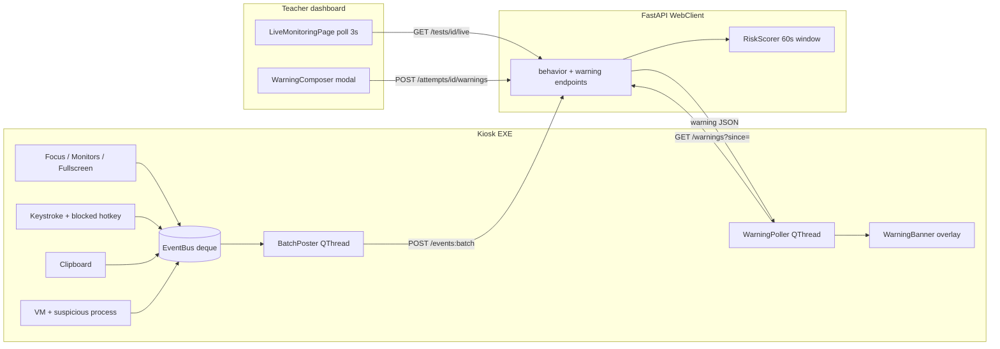

# Welcome to Omniproctor

!!! info "Project Status"
    This project is currently a **Work In Progress (WIP)**. Features and documentation are actively being developed and improved.

## Overview

Welcome to **Omniproctor** - a comprehensive online assessment and proctoring platform designed to conduct secure, monitored examinations in a controlled digital environment.

## What is Omniproctor?

Omniproctor is a full-stack proctoring solution that combines a **secure browser application** with a **web-based dashboard** to provide end-to-end management of online assessments. 

### Key Features

- **Secure Browser**: Custom PyQt6-based browser with built-in proctoring controls
- **Network Isolation**: Automated firewall configuration to restrict network access during exams
- **Kiosk Mode**: Prevents users from switching to other applications
- **Dashboard Management**: Web-based interface for creating and managing tests
- **User Management**: Role-based access control for administrators and test-takers
- **Real-time Monitoring**: Live per-attempt risk scoring, focus / monitor / VM / clipboard / keystroke telemetry, and teacher-to-student warning channel

## Proctoring data flow

The kiosk emits all telemetry through a thread-safe in-process `EventBus` that
is drained every 5 seconds (or immediately on a `critical` event) by a
background `BatchPoster` thread. The teacher dashboard short-polls the
WebClient every 3 seconds for an aggregated snapshot, and the kiosk in turn
short-polls every 3 seconds for any warnings the teacher has sent.



!!! warning "Privacy: full keystroke capture"
    During proctored sessions the kiosk records **every** keystroke. The splash
    screen surfaces a one-line consent notice and storage is metadata-only
    (`{key, modifiers, foreground_proc, ts}`) — never a reconstructed string —
    so accidental log dumps will not trivially leak typed answer text. The
    recording itself is exhaustive. Set `KIOSK_DISABLE_KEYLOGGER=1` to opt out
    during local development (other telemetry monitors keep running).

## System Components

### 1. Browser Application
A standalone desktop application built with PyQt6 that provides:
- Secure web browsing with restricted access
- Kiosk mode to prevent task switching

### 2. WebClient (Web Application)
A full-stack web application consisting of:
- **Backend**: FastAPI REST API with SQLAlchemy ORM
- **Frontend**: React + Mantine, built with Vite
- **Database**: PostgreSQL for users, tests, behavior events, warnings, and the live monitoring snapshot

## Getting Started

### Prerequisites

- **For Browser Application**:
    - Windows 10/11 (x64)
    - Python 3.10 or higher (only for source-tree dev runs; the installer ships its own runtime)
    - Administrator privileges (required for the native Windows Filtering Platform integration)

!!! info "Native firewall (no external dependency)"
    The browser ships a built-in app-level firewall built directly on the
    Windows Filtering Platform via ``fwpuclnt.dll``. There is no external
    SimpleWall / third-party firewall dependency – install the kiosk and
    you're done.

- **For WebClient**:
    - Python 3.12 or higher (backend)
    - Node.js 18 or higher (frontend)
    - PostgreSQL database
    - `uv` for dependency management

### Quick Start

#### 1. Setting Up the WebClient

**Backend (FastAPI):**

```bash
cd WebClient
uv sync
uv run uvicorn app.main:app --reload
```

**Frontend (React + Mantine):**

```bash
cd WebClient/frontend
npm install
npm run dev
```

#### 2. Running the Secure Browser

```powershell
cd Browser
uv sync
uv run python browser\main.py "https://app.example.com/exam/123"
```

For production: build the installer with `Browser/build/build.ps1` and install
the resulting `.exe`. The `omniproctor-browser://` URL protocol is registered
unconditionally so the WebClient can launch the kiosk directly from a button.

#### 3. Initial Login

1. Access the dashboard at `http://localhost:5173` (or configured port)
2. Login with your credentials
3. Create or join a test
4. Teachers / admins can open `/portal/live` to monitor active attempts in real time
5. Launch the secure browser for taking assessments

## Project Structure

```
Omniproctor/
├── Browser/                       # Secure kiosk browser
│   ├── browser/
│   │   ├── main.py                # Browser engine + kiosk lockdown
│   │   ├── keyblocks.py           # Keyboard/hotkey blocking
│   │   ├── network/               # WFP firewall controller
│   │   ├── telemetry/             # EventBus, BatchPoster, WarningPoller
│   │   ├── security/              # VM detection, suspicious process scanner
│   │   └── ui/                    # Splash, top bar, warning banner, theme
│   ├── build/                     # PyInstaller spec, Inno Setup, build.ps1
│   └── pyproject.toml
│
├── WebClient/                     # FastAPI + React proctoring service
│   ├── app/
│   │   ├── api/v1/endpoints/      # auth, tests, attempts, behavior, warnings, live
│   │   ├── models/                # SQLAlchemy: User, Test, Attempt, BehaviorEvent, ProctorWarning
│   │   ├── services/              # auth, attempts, risk_scorer, live_service
│   │   └── schemas/               # Pydantic schemas
│   ├── frontend/                  # React + Mantine dashboard (LiveMonitoringPage, etc.)
│   └── tests/                     # pytest unit + integration tests
│
└── docs/                          # Documentation (MkDocs)
```

## Rules and Guidelines

!!! warning "Important Rules"
    - The browser must be launched with administrator privileges for full security features
    - Ensure stable internet connection before starting a test
    - Report any technical issues immediately to administrators

## Support

For technical support or bug reports, please contact the development team or create an issue in the project repository.
